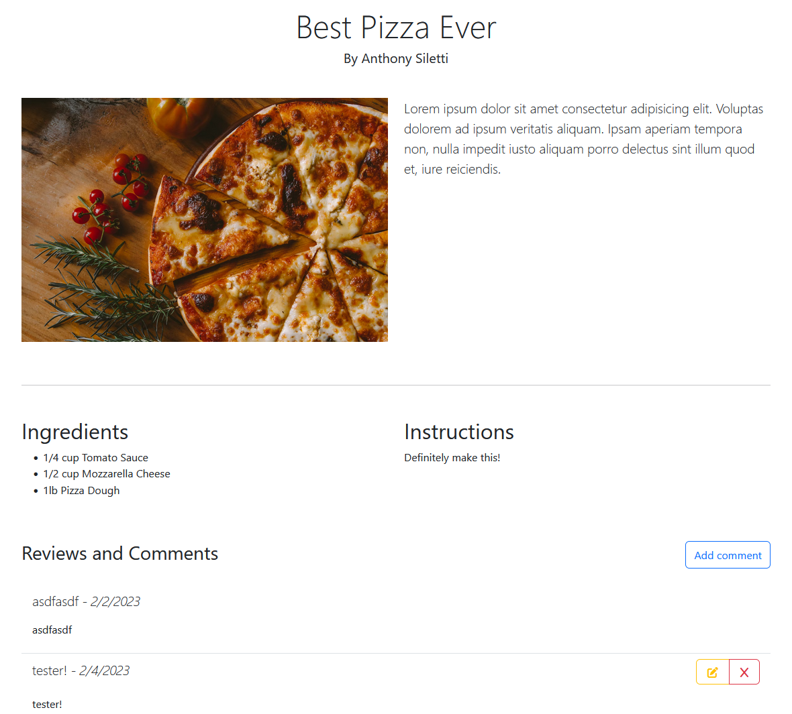
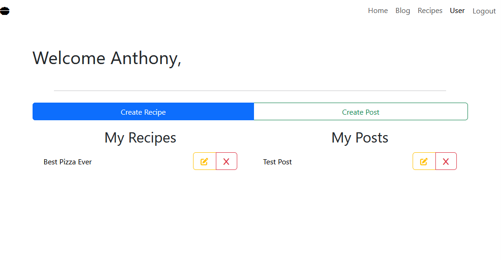
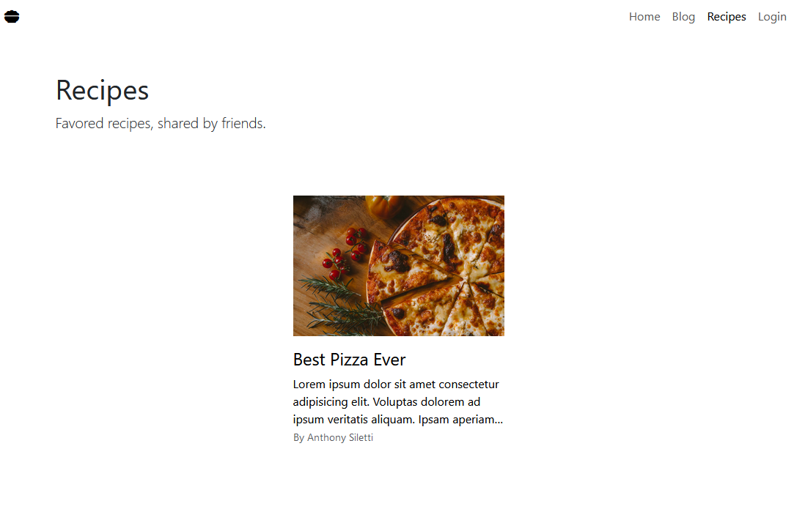

# Welcome to Master Cook

## Create and Share Your Favorites

## Getting Started

To visit the site, please to go [Master Cook](https://long-calf-underwear.cyclic.app/)

Master Cook can be used freely to view exising recipes and blog posts but in order to create and share your own recipes and tips/tricks you will have to create an account.

Simply log in to your account or create one to enjoy the full epicness of Master Cook.

## Site Functionality

As stated, logged in users can create and share recipes and tips/tricks via posts, but logged in users can do much more. They can also edit their recipes and posts in addition to being able to comment on any recipe and/or post. Users can also edit those comments that they have created.

As seen below, you can add a comment and edit an already existing comment that you have created.

As a logged in user, you'll see a list of all recipes and posts that you have created. Through this page, you'll be able to create new recipes/posts and edit existing recipes/posts that you have already created.

And, of course, you can view any recipe, post, and associated comments, freely without having to log in.

## Next Steps

- Ability to save posts/recipes to your "saved posts" list
- Abilty to edit user information

## Technologies Used

- HTML
- CSS
- JavaScript
- React
- React Router
- EJS
- Mongoose
- MongoDB
- Express
- Node
- JWT (JSON Web Tokens)

## Trello Board, Wireframe, and ERD

[Trello Board](https://trello.com/b/4jg89MOn/master-cook-blog)
[ERD/Wireframe](https://lucid.app/lucidchart/557c916f-5679-4120-87e9-964b6edbaf02/edit?viewport_loc=-72%2C-718%2C843%2C1229%2C0_0&invitationId=inv_2f5e72c9-8e9d-4c4d-a63c-e37be308877e)
